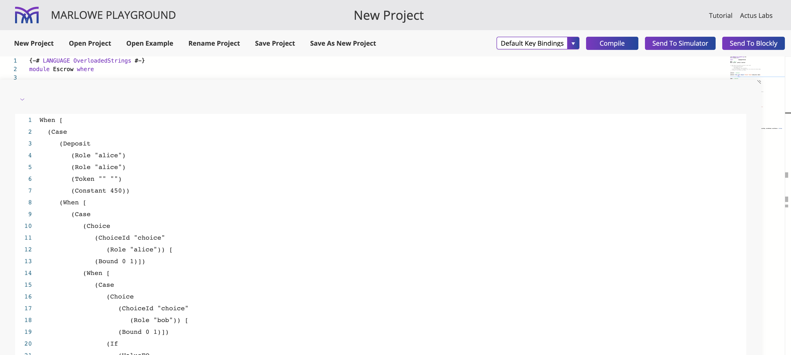

## For experienced Haskell developers

As an experienced Haskell developer you can use the Haskell editor to render Marlowe code. Marlowe is written as a Haskell data type, and thus it is straightforward to generate Marlowe smart contracts using Haskell.

## Opening the Marlowe Playground

To use the Haskell editor follow these steps:

1. Open the [Marlowe Playground](https://play.marlowe-finance.io).

2. Click the **Start in Haskell** icon. 

    You will see a window like this:
    

## Coding in Haskell

3. Now you can start coding in Haskell. 
  
    Alternatively, you can use some [example contracts](examples/contract-examples.md#more-marlowe-contract-examples) to work with. 

## Describing a contract

4. To describe a contract in the editor, define a top-level value contract of type `Contract`, add conditions, and close the contract. 

    The following window will open for an Escrow contract:
    

## Compiling into Marlowe

5. Click **Compile** to convert this value from Haskell into Marlowe.

## Sending to simulator

6. Then, click **Send to Simulator**. 

   The Simulator allows you to simulate Marlowe contracts transaction by transaction. You can find more instructions on how to use the Haskell editor in the [Marlowe embedded in Haskell tutorial](tutorials/embedded-marlowe.md). 
   