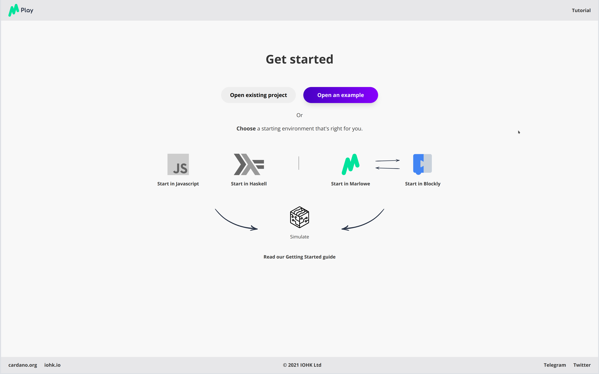

## Powerful

Marlowe provides an expressive domain-specific language (DSL) for a broad spectrum of financial and transactional contracts. Use it for traditional financial instruments, auctions, token applications, and novel use cases. 

## Robust

Formal proofs, extensive testing, and analysis tools provide strong assurances for the safety of Marlowe contracts. Lighten the effort needed to audit your contracts because much of that burden is borne by Marlowe itself. 

## Accessible

Designing Marlowe contracts only requires clear logical thinking, not specialized programming skills. Develop with its full suite of tooling that supports all skill levels, for both the community and enterprises. 

## What is a Marlowe contract? 

A Marlowe contract is built by combining a small number of building blocks that describe making a payment, making an observation of something in the "real world," waiting until a certain condition becomes true, and other similar types of concepts. 

## Tutorials

If you want to learn Marlowe from the ground up, start with Marlowe's [written tutorials](tutorials/written-tutorials-index.md) and [video tutorials](tutorials/video-tutorials-index.md). 

Or jump right into the [Marlowe Playground](https://play.marlowe-finance.io): 

See also: 

## [Marlowe contract development and deployment overview](development/deployment-overview.md)

## [Advantages of using Marlowe DSL](development/dsl.md)

## [How Marlowe contracts are protected](development/platform.md#how-marlowe-contracts-are-protected)
