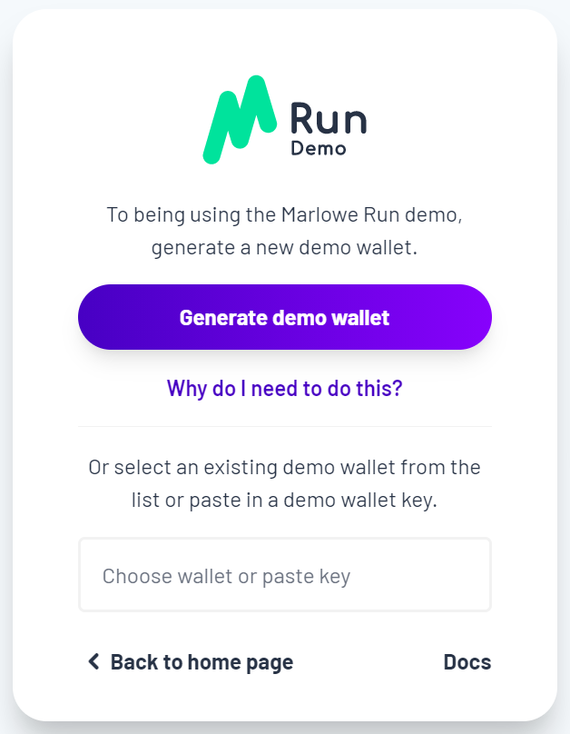
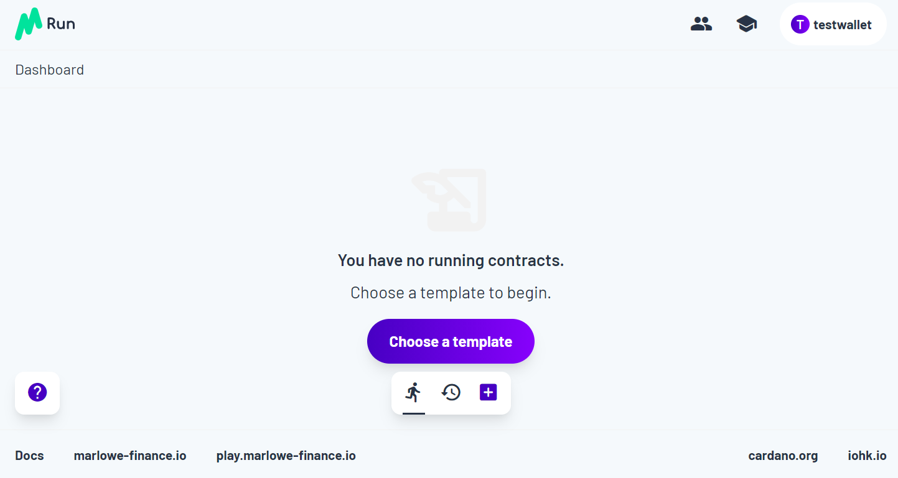
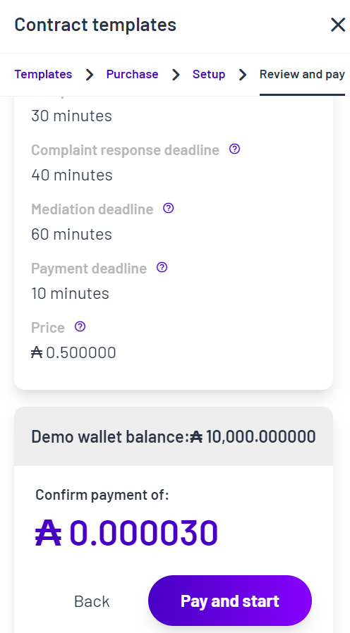

# Using Marlowe Run **[DEPRECATED]**

Get your smart contracts up and running in minutes. Marlowe Run provides
an intuitive, straightforward, and seamless interface for you to handle
financial agreements with your friends, colleagues, or clients on the
blockchain. It gives you access to expertly crafted, secure smart
contract templates for any type of agreement that you want to use.

Marlowe Run is a fast and easy way to use and run contracts on Cardano.
You will find a selection of financial contract templates so you can
pick the right smart contract for you. Once you choose a template, you
simply add in roles and terms, and then run your contract. You will be
using the prototype version of Marlowe Run.

**Note**: This prototype version of Marlowe Run provides a demo version
that uses test contracts and simulated funds. The full version of
Marlowe Run will be available soon.

## Accessing the Marlowe Run Demo

To access and view the dashboard, follow these steps:

1.  Visit the [Marlowe website](https://marlowe-finance.io/) and click
    **Marlowe Run** on the main menu.
2.  Click **Try demo**.
3.  The Marlowe Run demo is launched:

For this demo version of Marlowe Run, test wallets are generated with
10k ADA in them, so that you can use the service. You can use any wallet
that exists on the server as long as you know the public key. This will
become the integration point with a real wallet in the full version of
Marlowe Run, where only the wallet owner can authorize payments.

4.  Click **Generate demo wallet** to use a demo wallet.
5.  Enter a nickname for your demo wallet. You can only use letters and
    numbers for the nickname.

6.  Click **Use**.

After you have selected your wallet, the following screen is displayed:

7.  Click **Choose a template** to use a template to create your
    contract.

The Contract templates selection card is displayed with three options
(Purchase, Loan, CFD), as follows:

8.  Click the contract template you want to use, for example, Purchase.

An overview card is displayed, as follows:

9.  Click **Setup** to proceed and run the contract.
10. Enter the following details for the contract:

-   Title
-   Roles: Buyer, Mediator, Seller
-   Terms: Price, Payment deadline, Complaint deadline, Complaint
    response deadline, Mediaton deadline

11. Then click **Review**.
12. Review the information on the confirmation card.
13. Then click **Pay and start** to run the contract.

The running contract dialog is displayed on the contracts dashboard.
This shows a counter with the time allocated within which the
participants must make a deposit. Depending on the contract you may need
to wait for a participant to make a deposit before you can proceed.

14. Click **Deposit** to make the required deposit.

15. Confirm your payment by clicking **Deposit** again.
16. Click **Everything is alright** to confirm you are happy to proceed.
    Otherwise, you can click **Report a problem** if there is an issue.
17. Then click **Choose** to proceed. A confirmation message is
    displayed to confirm that the transaction was submitted
    successfully.

Note that if you do not act within the allocated time period, the
contract will time out and you will have to close the contract and start
again. If this happens, the balance of the account will be redeemed to
the owner of the role.

You can click **Close contract** at any time to close a running
contract.

## Adding Contacts

You can maintain a list of your active contacts that you regularly
communicate with.

To add a new contact, follow these steps:

1.  Click the **Contacts** icon on the main menu.
2.  Click **New contact** to record the details of a new contact.
3.  Enter a nickname and the wallet ID for the contact and click
    **Save**. Your new contact is added to your contacts list.
