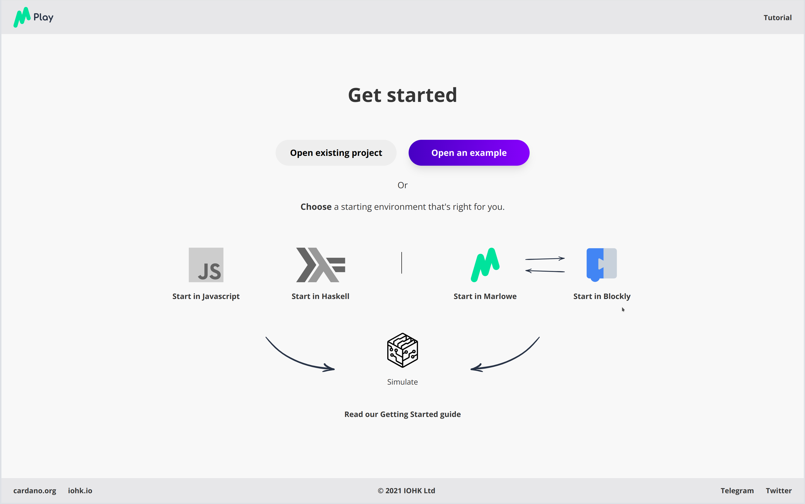
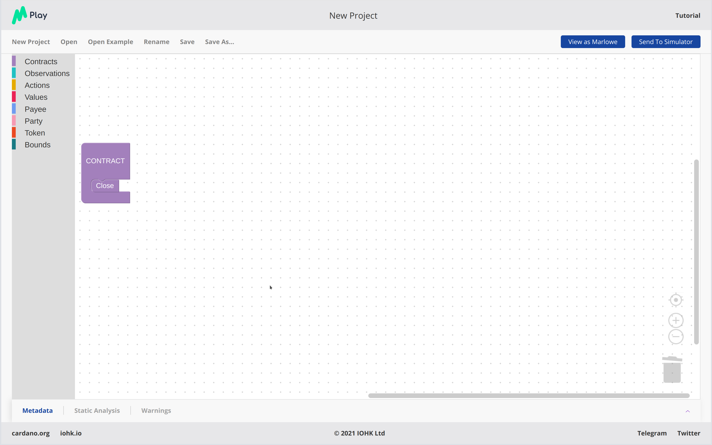
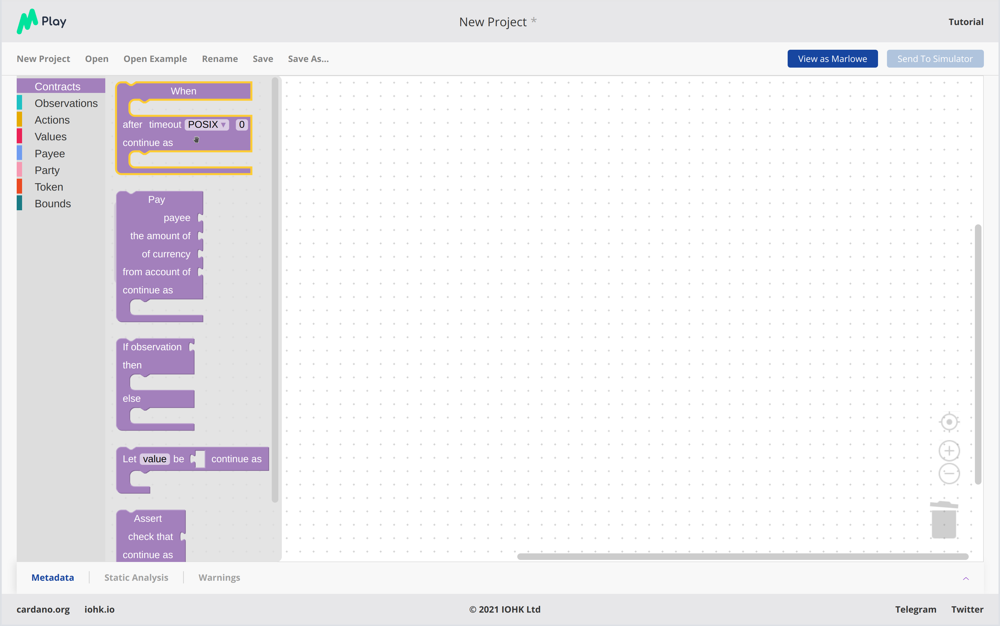
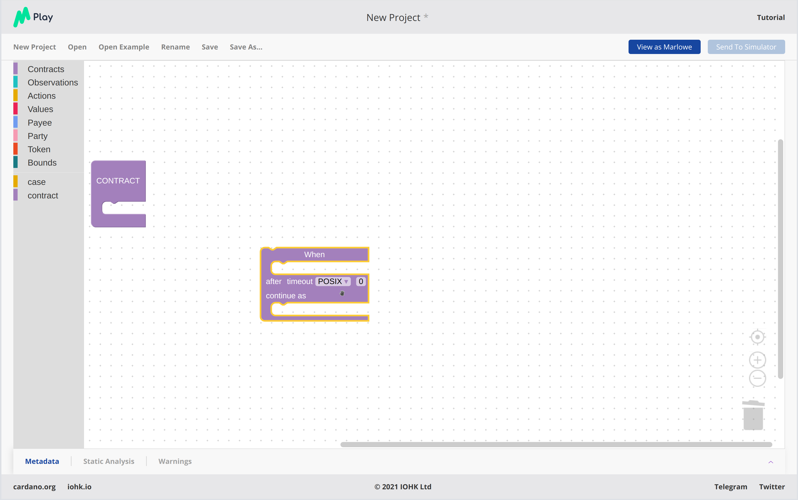
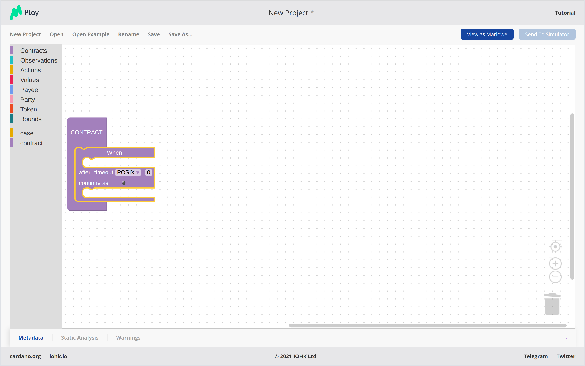
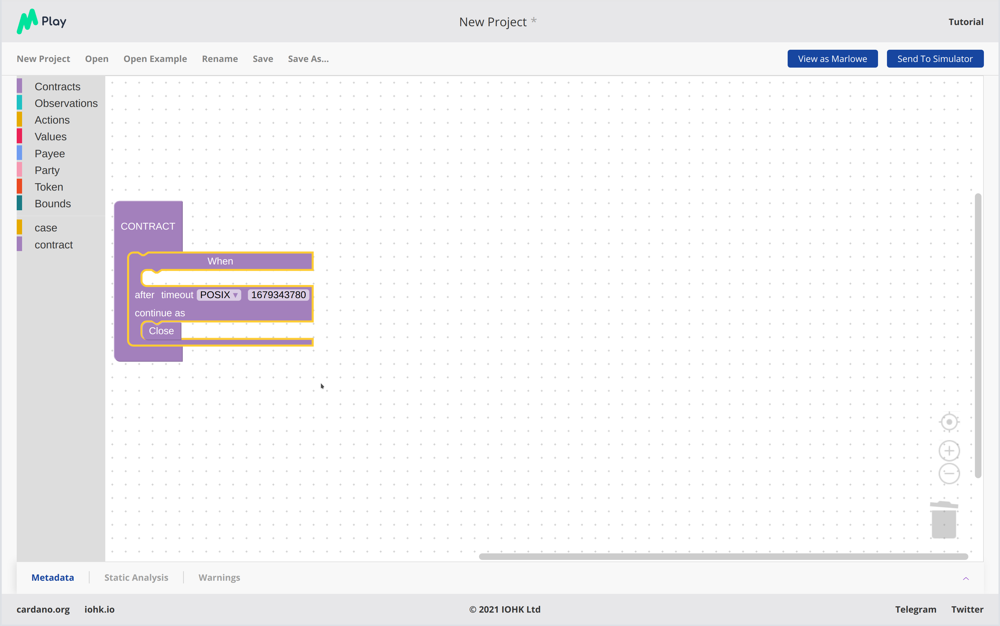
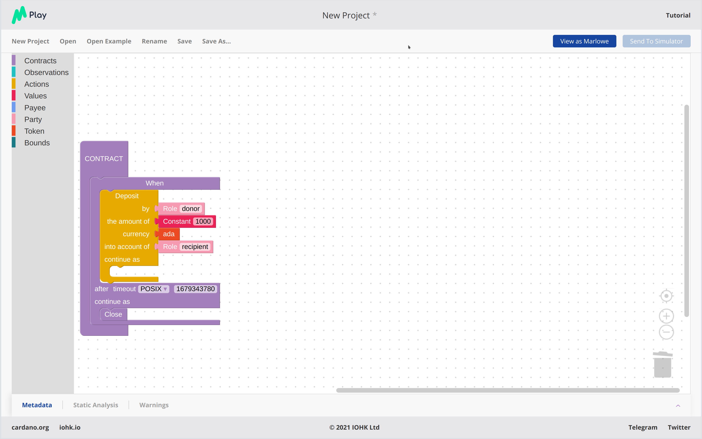
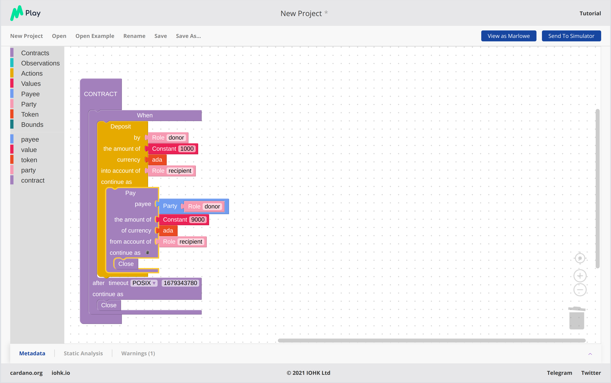
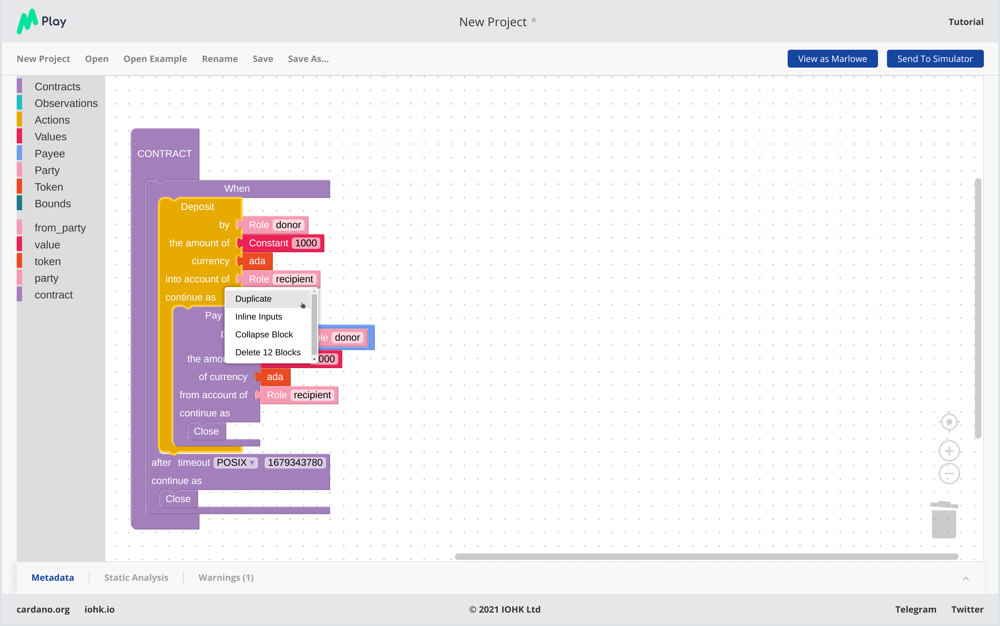

# Marlowe in Blockly

So far in these tutorials we have concentrated on building contracts in
the textual version of Marlowe, embedded in Haskell, Marlowe contracts
can also be built using the Blockly visual programming environment, as
we describe here.

## Getting started

To start building a Blockly project in the Marlowe Playground, which you
can find out more about in the section about [playground overview](playground-overview.md). On the home screen

select **Start in Blockly**. You will now see a screen like this:

Contracts are assembled by adding components to the holes in the blocks.
To build a contract, we have to fill the single, top-level, hole here in
the CONTRACT block with a `Contract`: you can see that it filled with a
`Close` here.

Blocks are selected by clicking on them: the currently selected blocks
are outlined in yellow, as here:

Once a block or blocks are selected you can move them directly; cut,
copy and delete them using your operating system\'s usual short cuts;
and access other operations by right-clicking on them.

Suppose that you remove the `Close` block and you want to build another
contract. The block templates for contracts are found by clicking on
**Contracts** in the menu on the left hand side. Doing this shows all
the different blocks that build contracts, as shown here:

We can select one and drag it into the editing area, which has a dotted
background, like this:

Looking at the menu on the left hand side, you can see two new entries
below the original: these tell you what kind of block you need to fit
into each of the holes in the currently selected block (that is the
block outlined in yellow).

In the example here you can see that the upper hole requires a *case*
block while the lower one needs to be filled by another *contract*.

Let\'s fit the contract into the top-level hole, so that we\'re
constructing a contract with a `When` as its main construct.

We can then repeat this process, adding contracts and other types of
components -- all of which are shown in the menu on the left-hand side
-- to build a complete contract, that is a contract that contains no
holes.

Let\'s fill in the timeout information and add a `Close` contract to be
performed in the case of timeout:

What action should we choose now? Again we see all the possible actions
by selecting **case** or **Actions** in the menu:

If we select a `Deposit` action we have a number of different types of
holes to fill.

Here we have to choose

-   A **from_party** for the depositor,
-   A **value**, which is the amount deposited ...
-   ... in which **currency**, or **token** (often ada)
-   Into which account, given by a **party**, which is either a role or
    a public key.
-   The continuation **contract**.

In filling in some of these we have also to fill in a text field, or a
number, as shown in the final result here.

Finally, we have to decide what the *continutation* contract is: what
does the contract do next? That\'s another contract. Here it is
completed as a payment:

### Exercises

In Blockly, complete for yourself the construction of the contract
above.

What is the effect of the example contract? In particular, what are the
payments made by the contract?

## Editing Blockly

Blockly contracts can be manipulated and edited using visual gestures
and keyboard short cuts.

-   Blocks can be **dragged** from holes, as well as being inserted.
-   There is a **right click menu** available, as seen in the image
    above, offering a range of options.
-   Typical editing short cuts are operative, e.g. DEL, ⌘C, ⌘V, and ⌘X
    on Mac OS.
